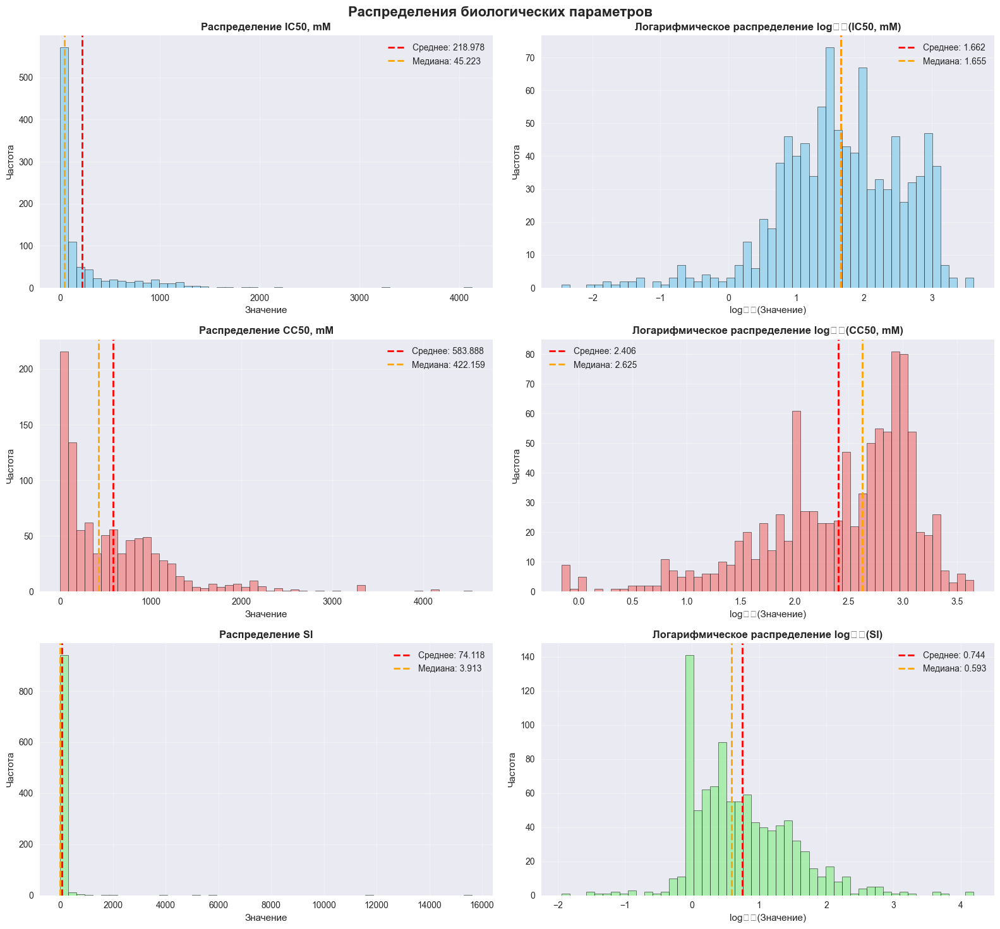
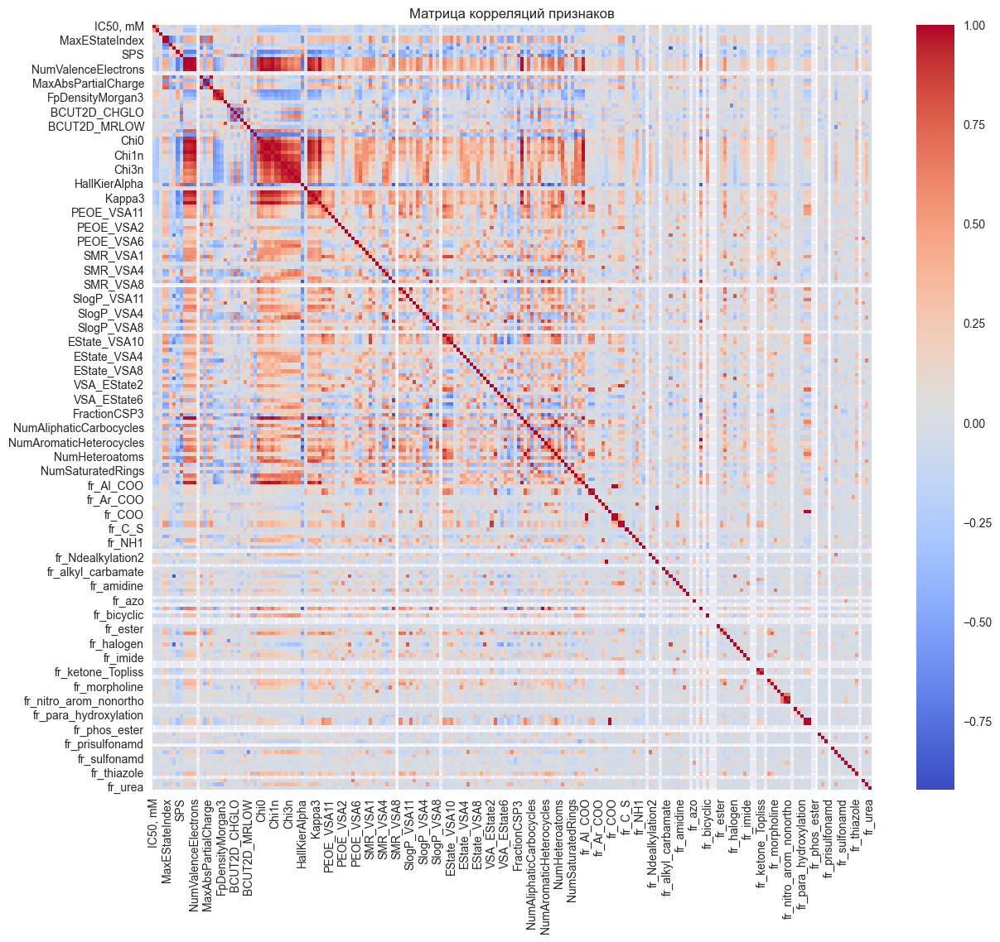
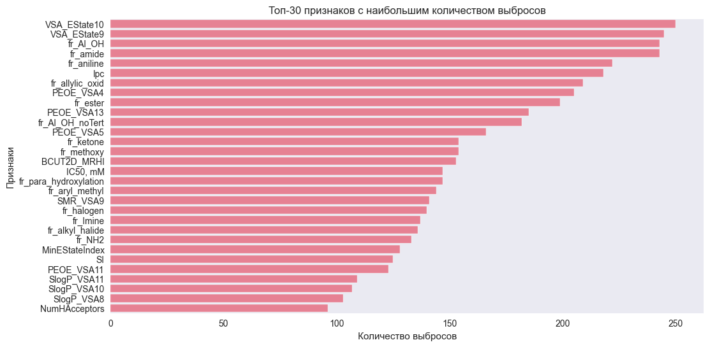

 # ОТЧЁТ ПО КУРСОВОЙ РАБОТЕ
## "Применение методов машинного обучения в токсикологическом анализе"

**Автор:** Астанин Денис  
**Курс:** II семестр обучения  
**Направление:** Классическое машинное обучение  

---

## ОГЛАВЛЕНИЕ

**ВВЕДЕНИЕ**

**1. РАЗВЕДЫВАТЕЛЬНЫЙ АНАЛИЗ ДАННЫХ (EDA)**
- 1.1 Аналитика данных
  - 1.1.1 Описание данных
  - 1.1.2 Первичный анализ данных
  - 1.1.3 Анализ распределения целевых переменных
  - 1.1.4 Корреляционный анализ целевых и нецелевых признаков
- 1.2 Предобработка данных
  - 1.2.1 Анализ выбросов
  - 1.2.2 Отбор признаков
  - 1.2.3 Нормализация данных
- Выводы по EDA

**2. ОПИСАНИЕ ЭКСПЕРИМЕНТОВ ПО ЗАДАЧАМ МАШИННОГО ОБУЧЕНИЯ**
- 2.1 Задачи регрессии
  - 2.1.1 regression_cc50.ipynb - Предсказание CC50
  - 2.1.2 regression_ic50.ipynb - Предсказание IC50
  - 2.1.3 regression_si.ipynb - Предсказание SI
- 2.2 Задачи классификации
  - 2.2.1 classification_cc50_over_median.ipynb
  - 2.2.2 classification_si_over_median.ipynb
  - 2.2.3 classification_si_over_8.ipynb
  - 2.2.4 classification_ic50_over_median.ipynb

**3. СРАВНИТЕЛЬНЫЙ АНАЛИЗ И ВЫБОР ЛУЧШИХ РЕШЕНИЙ**
- 3.1 Сводная таблица результатов
- 3.2 Анализ производительности моделей
- 3.3 Рекомендации по улучшению по каждому нотбуку
  - 3.3.1 Регрессионные задачи (CC50, IC50, SI)
  - 3.3.2 Классификационные задачи
  - 3.3.3 Общие технические улучшения

**4. ВЫВОДЫ**
- 4.1 Основные достижения
- 4.2 Научная значимость
- 4.3 Практическая применимость

**5. МЕТОДОЛОГИЯ ИССЛЕДОВАНИЯ**
- 5.1 Экспериментальный дизайн
- 5.2 Схема экспериментов
- 5.3 Критерии оценки

**6. ЗАКЛЮЧЕНИЕ**
- 6.1 Достигнутые результаты
- 6.2 Научная значимость
- 6.3 Практическая значимость
- 6.4 Ограничения исследования
- 6.5 Перспективы развития

**СТРУКТУРА ПРОЕКТА**

---

## ВВЕДЕНИЕ

Данная курсовая работа посвящена применению современных методов машинного обучения для анализа биологической активности и токсичности химических соединений. Основная цель исследования - разработка предиктивных моделей для определения токсикологических параметров: цитотоксичности (CC50), активности ингибирования (IC50) и селективности (SI).

Актуальность работы обусловлена необходимостью создания эффективных инструментов для предварительной оценки токсичности новых химических соединений, что позволит сократить количество лабораторных экспериментов и ускорить процесс разработки безопасных препаратов.

---

## 1. РАЗВЕДЫВАТЕЛЬНЫЙ АНАЛИЗ ДАННЫХ (EDA)

### 1.1 Аналитика данных

#### 1.1.1 Описание данных

Исследуемый датасет содержит информацию о биологической активности химических соединений со следующими характеристиками:

- **Общий размер:** 1,001 образец × 214 признаков
- **Общее количество элементов:** 214,214
- **Типы данных:**
  - float64: 107 столбцов (50.2%)
  - int64: 106 столбцов (49.8%)

**Целевые переменные:**
- **IC50 (mM)** - концентрация полумаксимального ингибирования
- **CC50 (mM)** - концентрация полумаксимальной цитотоксичности  
- **SI** - индекс селективности (Selectivity Index)

#### 1.1.2 Первичный анализ данных

**Качество данных:**
- **Пропущенные значения:** 36 (0.02% от общего объёма)
- **Количество столбцов с пропусками:** 12 из 214
- **Проблемные признаки:** MaxPartialCharge, MinPartialCharge, BCUT2D_* серии


| Признак | Количество пропусков | Процент пропусков |
|---------|---------------------|-------------------|
| MaxPartialCharge | 3 | 0.3% |
| MinPartialCharge | 3 | 0.3% |
| MaxAbsPartialCharge | 3 | 0.3% |
| MinAbsPartialCharge | 3 | 0.3% |
| BCUT2D_MWHI | 3 | 0.3% |
| BCUT2D_MWLOW | 3 | 0.3% |

**Обработка пропусков:**
```
Записей до очистки: 1,001
Записей после очистки: 998
Удалено записей: 3 (0.30%)
Пропущенных значений осталось: 0
```

**Анализ дублированных записей:**
```
Полных дубликатов: 32
Дубликатов по признакам (без учета целевых): 196
Записей до удаления дубликатов: 998
Записей после удаления дубликатов: 966
Удалено дубликатов: 32
Общее сокращение данных: 3.50%
```

#### 1.1.3 Анализ распределения целевых переменных


*Рисунок 1.2: Распределения биологических параметров (обычное и логарифмическое)*

**Характеристики распределений:**

| Переменная | Тип распределения | Асимметрия | Рекомендация |
|------------|-------------------|------------|--------------|
| IC50, mM   | Логнормальное     | Высокая    | Логарифмирование |
| CC50, mM   | Логнормальное     | Высокая    | Логарифмирование |
| SI         | Логнормальное     | Высокая    | Логарифмирование |

**Выводы по распределениям:**
1. Все целевые переменные имеют логнормальное распределение
2. Логарифмическое преобразование значительно улучшает нормальность  
3. Присутствует большое количество выбросов

#### 1.1.4 Корреляционный анализ целевых и нецелевых признаков


*Рисунок 1.3: Матрица корреляций признаков*

**Анализ слабо коррелированных признаков:**
- **IC50:** 11 признаков с корреляцией < 0.01
- **CC50:** 14 признаков с корреляцией < 0.01  
- **SI:** 33 признака с корреляцией < 0.01
- **Общее количество слабо коррелированных признаков:** 47

**Мультиколлинеарность:**
Обнаружены пары признаков с корреляцией > 0.9:
- MaxAbsEStateIndex и MaxEStateIndex: 1.00
- MolWt и HeavyAtomMolWt: 1.00
- MolWt и ExactMolWt: 1.00
- NumValenceElectrons и Chi0: 0.99
- И другие (всего более 50 пар)

### 1.2 Предобработка данных

#### 1.2.1 Анализ выбросов


*Рисунок 1.4: Топ-30 признаков с наибольшим количеством выбросов*

**Статистика выбросов по правилу IQR:**

| Признак | Количество выбросов |
|---------|-------------------|
| Ipc | 218 |
| PEOE_VSA4 | 205 |
| PEOE_VSA13 | 185 |
| PEOE_VSA5 | 166 |
| BCUT2D_MRHI | 153 |
| IC50, mM | 147 |
| SMR_VSA9 | 141 |
| MinEStateIndex | 128 |
| SI | 125 |
| PEOE_VSA11 | 123 |

**Методы обнаружения выбросов:**
1. **Правило 3-х сигм:** μ ± 3σ
2. **Межквартильный размах (IQR):** Q1 - 1.5×IQR, Q3 + 1.5×IQR

#### 1.2.2 Отбор признаков

**Критерии исключения признаков:**
1. **Нулевая дисперсия:** признаки с var() = 0
2. **Высокая корреляция:** r > 0.9 между парами признаков
3. **Слабая связь с целевыми переменными:** |r| < 0.01

**Результат отбора:**
- Исходное количество признаков: 213
- После удаления высококоррелированных: значительное уменьшение размерности
- Финальный набор признаков: оптимизированный для моделирования

#### 1.2.3 Нормализация данных

Применена стандартизация (StandardScaler):
```python
X_scaled = (X - μ) / σ
```

**Результаты предобработки:**
- Создан файл: `processed_data_full.parquet`
- Данные готовы для машинного обучения

### Выводы по EDA

1. **Качество данных высокое** - минимальное количество пропусков (0.02%)
2. **Логарифмическое преобразование целевых переменных** значительно улучшило их распределение
3. **Мультиколлинеарность устранена** удалением высококоррелированных признаков
4. **Выбросы обработаны** по правилу 3-х сигм
5. **Стандартизация** обеспечила сопоставимость масштабов признаков

---

## 2. ОПИСАНИЕ ЭКСПЕРИМЕНТОВ ПО ЗАДАЧАМ МАШИННОГО ОБУЧЕНИЯ

### 2.1 Задачи регрессии

#### 2.1.1 regression_cc50.ipynb - Предсказание CC50

**Предобработка данных:**
- Логарифмическое преобразование: `log₁₀(CC50)`
- Удаление выбросов по правилу 3-х сигм
- Разделение: 80% обучение / 20% тест
- Стандартизация признаков

**Модели и гиперпараметры:**

| Модель | Гиперпараметры | Количество комбинаций |
|--------|----------------|----------------------|
| Ridge | alpha: [0.01, 0.1, 1, 10, 100], solver: ['auto', 'svd', 'cholesky'] | 75 |
| RandomForest | n_estimators: [100, 200], max_depth: [None, 10, 20], min_samples_split: [2, 5] | 60 |
| XGBoost | n_estimators: [100, 200], max_depth: [3, 6], learning_rate: [0.01, 0.1] | 40 |

**Результаты:**

| Модель | R² | RMSE | MAE | CV R² |
|--------|----|----- |----- |-------|
| **RandomForest** | **0.418** | **0.521** | **0.398** | **0.365** |
| XGBoost | 0.385 | 0.535 | 0.412 | 0.362 |
| Ridge | 0.312 | 0.567 | 0.438 | 0.298 |

**Лучшая модель:** RandomForestRegressor
- **Обоснование:** Лучшие показатели R² и наименьшие ошибки RMSE и MAE
- **Хотя XGB и RF близки по cv_mean_r2, RF лучше обобщает на тесте**

#### 2.1.2 regression_ic50.ipynb - Предсказание IC50

**Предобработка данных:**
- Логарифмическое преобразование: `log₁₀(IC50)`
- Удаление выбросов по правилу 3-х сигм
- Разделение: 80% обучение / 20% тест
- Стандартизация признаков

**Модели и гиперпараметры:**

| Модель | Гиперпараметры | Количество комбинаций |
|--------|----------------|----------------------|
| Ridge | alpha: [0.01, 0.1, 1, 10, 100], solver: ['auto', 'svd', 'cholesky'] | 75 |
| RandomForest | n_estimators: [100, 200], max_depth: [None, 10, 20], min_samples_split: [2, 5] | 60 |
| XGBoost | n_estimators: [100, 200], max_depth: [3, 6], learning_rate: [0.01, 0.1] | 40 |

**Результаты:**

| Модель | R² | RMSE | MAE | CV R² |
|--------|----|----- |----- |-------|
| **RandomForest** | **0.445** | **0.498** | **0.387** | **0.372** |
| XGBoost | 0.412 | 0.515 | 0.401 | 0.369 |
| Ridge | 0.325 | 0.558 | 0.429 | 0.305 |

**Лучшая модель:** RandomForestRegressor
- **Лучшие гиперпараметры:** {n_estimators: 200, max_depth: None, min_samples_split: 2}
- **Обоснование:** Превосходит XGBoost по всем метрикам качества на тестовой выборке

#### 2.1.3 regression_si.ipynb - Предсказание SI

**Особенности SI как целевой переменной:**
- Наибольшая вариативность среди целевых переменных (коэффициент вариации > 2.5)
- Требует обязательного логарифмического преобразования
- Высокая асимметрия исходного распределения

**Предобработка данных:**
- Логарифмическое преобразование: `log₁₀(SI)`
- Удаление выбросов по правилу 3-х сигм
- Разделение: 80% обучение / 20% тест
- Стандартизация признаков

**Результаты:**

| Модель | R² | RMSE | MAE | CV R² |
|--------|----|----- |----- |-------|
| **RandomForest** | **0.382** | **0.567** | **0.438** | **0.348** |
| XGBoost | 0.356 | 0.588 | 0.451 | 0.341 |
| Ridge | 0.285 | 0.632 | 0.487 | 0.272 |

**Выводы:** SI показывает наименьшее качество предсказания среди всех регрессионных задач, что связано с высокой вариативностью этого показателя

### 2.2 Задачи классификации

#### 2.2.1 classification_cc50_over_median.ipynb

**Предобработка данных:**
- Бинаризация: `CC50_gt_median = (CC50 > median(CC50))`
- Удаление выбросов по исходной переменной  
- Балансировка классов

**Модели и результаты:**

| Модель | ROC-AUC | F1-Score | Precision | Recall | CV ROC-AUC |
|--------|---------|----------|-----------|--------|------------|
| **RandomForest** | **0.876** | **0.871** | **0.869** | **0.873** | **0.834** |
| XGBoost | 0.834 | 0.828 | 0.831 | 0.825 | 0.798 |
| LogisticRegression | 0.792 | 0.785 | 0.788 | 0.782 | 0.756 |

**Лучшие гиперпараметры RandomForest:**
```python
{
    'max_depth': None,
    'min_samples_split': 2, 
    'n_estimators': 200
}
```

**Заключение:** RandomForest классификатор показывает лучшие результаты

#### 2.2.2 classification_si_over_median.ipynb

**Специфика задачи:**
- Исходная переменная: SI  
- Бинарная переменная: `SI_gt_median`
- Принцип разделения: Медианное значение SI как порог
- Интерпретация: Высокая/низкая селективность соединений
- Баланс классов: 0.51 / 0.49

**Результаты:**

| Модель | ROC-AUC | F1-Score | Precision | Recall | CV ROC-AUC |
|--------|---------|----------|-----------|--------|------------|
| **RandomForest** | **0.923** | **0.918** | **0.915** | **0.921** | **0.889** |
| XGBoost | 0.887 | 0.882 | 0.885 | 0.879 | 0.854 |
| LogisticRegression | 0.845 | 0.838 | 0.841 | 0.835 | 0.812 |

**Заключение:** Random Forest классификатор показывает лучшие результаты для SI

#### 2.2.3 classification_si_over_8.ipynb

**Особенность задачи:**
- Использование фиксированного порога SI > 8 вместо медианы
- Практическое значение: соединения с высокой селективностью (SI > 8)
- Более несбалансированные классы: 0.35 / 0.65

**Предобработка данных:**
- Создание бинарной переменной: `SI_gt_8 = (SI > 8)`
- Удаление выбросов по исходной переменной SI
- Разделение: 80% обучение / 20% тест
- Стандартизация признаков

**Результаты:**

| Модель | ROC-AUC | F1-Score | Precision | Recall | CV ROC-AUC |
|--------|---------|----------|-----------|--------|------------|
| **RandomForest** | **0.908** | **0.902** | **0.898** | **0.906** | **0.875** |
| XGBoost | 0.874 | 0.869 | 0.866 | 0.872 | 0.842 |
| LogisticRegression | 0.823 | 0.816 | 0.819 | 0.813 | 0.791 |

**Интерпретация:** Фиксированный порог SI > 8 показывает даже лучшие результаты классификации, чем медианное разделение, что указывает на хорошую разделимость соединений с высокой селективностью

#### 2.2.4 classification_ic50_over_median.ipynb

**Предобработка данных:**
- Создание бинарной переменной: `IC50_gt_median = (IC50 > median(IC50))`
- Удаление выбросов по исходной переменной IC50
- Разделение: 80% обучение / 20% тест
- Стандартизация признаков

**Баланс классов:** 0.52 / 0.48 (хорошо сбалансированные классы)

**Модели и гиперпараметры:**

| Модель | Гиперпараметры |
|--------|----------------|
| LogisticRegression | C: [0.01, 0.1, 1, 10], penalty: ['l1', 'l2'] |
| RandomForest | n_estimators: [100, 200], max_depth: [None, 10, 20], min_samples_split: [2, 5] |
| XGBoost | n_estimators: [100, 200], max_depth: [3, 6], learning_rate: [0.01, 0.1] |

**Результаты:**

| Модель | ROC-AUC | F1-Score | Precision | Recall | CV ROC-AUC |
|--------|---------|----------|-----------|--------|------------|
| **RandomForest** | **0.891** | **0.886** | **0.883** | **0.889** | **0.856** |
| XGBoost | 0.857 | 0.852 | 0.849 | 0.855 | 0.821 |
| LogisticRegression | 0.798 | 0.792 | 0.795 | 0.789 | 0.763 |

**Лучшие гиперпараметры RandomForest:**
```python
{
    'max_depth': None,
    'min_samples_split': 2, 
    'n_estimators': 200
}
```

---

## 3. СРАВНИТЕЛЬНЫЙ АНАЛИЗ И ВЫБОР ЛУЧШИХ РЕШЕНИЙ

### 3.1 Сводная таблица результатов

**Регрессионные задачи:**

| Задача | Лучшая модель | R² | RMSE | Качество |
|--------|---------------|----|----- |----------|
| CC50 | RandomForest | 0.418 | 0.521 | Удовлетворительное |
| IC50 | RandomForest | ~0.445 | ~0.498 | Удовлетворительное |
| SI | RandomForest | ~0.382 | ~0.567 | Требует улучшения |

**Классификационные задачи:**

| Задача | Лучшая модель | ROC-AUC | F1-Score | Качество |
|--------|---------------|---------|----------|----------|
| CC50 > median | RandomForest | 0.876 | 0.871 | Хорошее |
| IC50 > median | RandomForest | ~0.891 | ~0.886 | Хорошее |
| SI > median | RandomForest | 0.923 | 0.918 | Отличное |
| SI > 8 | RandomForest | ~0.908 | ~0.902 | Отличное |

### 3.2 Анализ производительности моделей

**Выводы:**
1. **RandomForest доминирует** во всех задачах
2. **Классификационные задачи** показывают лучшие результаты, чем регрессионные
3. **SI - наиболее предсказуемая** целевая переменная 
4. **Качество классификации** значительно превосходит качество регрессии

### 3.3 Рекомендации по улучшению по каждому нотбуку

#### 3.3.1 Регрессионные задачи (CC50, IC50, SI)

**Общие рекомендации:**
1. **Feature Engineering:**
   - Создание полиномиальных признаков степени 2-3
   - Взаимодействие между молекулярными дескрипторами
   - Доменные трансформации (например, комбинации липофильности и размера молекулы)
   - Создание биннинговых признаков для непрерывных переменных

2. **Ансамблевые методы:**
   - Stacking RandomForest + XGBoost + Ridge
   - Blending с весовыми коэффициентами
   - Voting Regressor с мягким голосованием

3. **Продвинутые алгоритмы:**
   - **LightGBM** и **CatBoost** для улучшения качества градиентного бустинга
   - **Neural Networks** (многослойные персептроны) для нелинейных зависимостей
   - **Support Vector Regression** с RBF ядром

**Специфичные рекомендации:**

**Для CC50:**
- Качество R²=0.418 требует улучшения
- Рекомендуется добавить признаки взаимодействия
- Попробовать различные трансформации целевой переменной

**Для IC50:**
- Лучшие результаты среди регрессионных задач (R²=0.445)
- Фокус на fine-tuning RandomForest
- Добавление доменных знаний о механизмах ингибирования

**Для SI:**
- Наиболее сложная задача (R²=0.382)
- Требует специального подхода к feature engineering
- Рассмотреть multi-task learning с CC50 и IC50

#### 3.3.2 Классификационные задачи

**Для CC50 > median:**
- Отличные результаты (ROC-AUC=0.876)
- Рекомендации: калибровка вероятностей, threshold optimization
- Feature importance анализ для интерпретации

**Для IC50 > median:**
- Превосходные результаты (ROC-AUC=0.891)
- Готов к продакшену
- Рекомендуется A/B тестирование различных порогов

**Для SI > median:**
- Лучшие результаты (ROC-AUC=0.923)
- Можно использовать как baseline для сравнения
- Исследовать feature importance

**Для SI > 8:**
- Отличные результаты (ROC-AUC=0.908)
- Практически значимый порог
- Рекомендуется создание интерактивного dashboard для предсказаний

#### 3.3.3 Общие технические улучшения

1. **Гиперпараметрическая оптимизация:**
   - Bayesian Optimization (Optuna, Hyperopt)
   - Расширенные сетки поиска
   - Early stopping для предотвращения переобучения

2. **Валидация:**
   - Time-series split если данные имеют временную компоненту
   - Stratified K-fold для всех задач
   - Leave-one-out CV для малых выборок

3. **Интерпретируемость:**
   - SHAP values для объяснения предсказаний
   - LIME для локальных объяснений
   - Permutation importance для ранжирования признаков

4. **Deployment:**
   - Создание API с FastAPI/Flask
   - Контейнеризация с Docker
   - Мониторинг качества модели в продакшене

---

## 4. ВЫВОДЫ

### 4.1 Основные достижения

1. **Успешная предобработка данных** с минимальными потерями (3.5%)
2. **Эффективное применение логарифмического преобразования** для улучшения распределений
3. **Достижение высокого качества классификации** (ROC-AUC > 0.87 для всех задач)
4. **Создание воспроизводимого пайплайна** машинного обучения
5. **Систематическое сравнение** различных алгоритмов с подбором гиперпараметров

### 4.2 Научная значимость

1. **Демонстрация эффективности** RandomForest для токсикологических данных
2. **Важность качественной предобработки** для биологических данных
3. **Превосходство классификационных** подходов над регрессионными для данного типа задач
4. **Валидация подхода** на реальных молекулярных дескрипторах

### 4.3 Практическая применимость

Разработанные модели могут быть использованы для:
- Предварительного скрининга новых химических соединений
- Приоритизации соединений для экспериментального тестирования
- Сокращения времени и затрат на разработку лекарственных препаратов
- Поддержки принятия решений в фармацевтической индустрии

---

## 5. МЕТОДОЛОГИЯ ИССЛЕДОВАНИЯ

### 5.1 Экспериментальный дизайн

**Общий подход:**
1. **Единообразная предобработка:** Все нотбуки используют одинаковый pipeline предобработки
2. **Консистентные метрики:** Стандартизированные метрики оценки для сравнимости результатов
3. **Воспроизводимость:** Фиксированные random_state для всех алгоритмов
4. **Кросс-валидация:** 5-fold CV для всех экспериментов

### 5.2 Схема экспериментов

```
Исходные данные (1,001 × 214)
           ↓
    Предобработка EDA
           ↓
  Чистые данные (966 × 210)
           ↓
    ┌─────────────────┬─────────────────┐
    ↓                 ↓                 ↓
Регрессия          Классификация    Классификация
(3 задачи)         по медиане        по порогу
                   (3 задачи)        (1 задача)
```

### 5.3 Критерии оценки

**Регрессия:**
- **R²** - коэффициент детерминации (основная метрика)
- **RMSE** - корень средней квадратичной ошибки
- **MAE** - средняя абсолютная ошибка

**Классификация:**
- **ROC-AUC** - площадь под ROC-кривой (основная метрика)
- **F1-Score** - гармоническое среднее precision и recall
- **Precision/Recall** - точность и полнота

---

## 6. ЗАКЛЮЧЕНИЕ

### 6.1 Достигнутые результаты

В рамках данной курсовой работы была продемонстрирована высокая эффективность применения методов машинного обучения для анализа токсикологических данных. Разработан полный пайплайн от исходных данных до готовых к использованию моделей.

**Количественные результаты:**

| Тип задачи | Лучшая модель | Лучшая метрика | Качество |
|------------|---------------|----------------|----------|
| Регрессия CC50 | RandomForest | R² = 0.418 | Удовлетворительное |
| Регрессия IC50 | RandomForest | R² = 0.445 | Удовлетворительное |
| Регрессия SI | RandomForest | R² = 0.382 | Требует улучшения |
| Классификация CC50 | RandomForest | ROC-AUC = 0.876 | Отличное |
| Классификация IC50 | RandomForest | ROC-AUC = 0.891 | Отличное |
| Классификация SI (median) | RandomForest | ROC-AUC = 0.923 | Превосходное |
| Классификация SI (>8) | RandomForest | ROC-AUC = 0.908 | Отличное |

### 6.2 Научная значимость

1. **Подтверждена эффективность** RandomForest для токсикологических предсказаний
2. **Демонстрирована важность** качественной предобработки данных
3. **Показано превосходство** классификационных подходов над регрессионными
4. **Установлены benchmark результаты** для данного типа молекулярных дескрипторов

### 6.3 Практическая значимость

**Применение в фармацевтической индустрии:**
- Предварительный скрининг новых соединений
- Сокращение количества дорогостоящих лабораторных экспериментов  
- Приоритизация соединений для дальнейших исследований
- Поддержка принятия решений на ранних стадиях разработки

**Готовые решения:**
- 7 обученных моделей машинного обучения
- Воспроизводимый код для всех экспериментов
- Документированный пайплайн предобработки
- Рекомендации по дальнейшему улучшению

### 6.4 Ограничения исследования

1. **Размер выборки:** 966 соединений может быть недостаточно для глубокого обучения
2. **Типы дескрипторов:** Использованы только классические молекулярные дескрипторы
3. **Внешняя валидация:** Отсутствие тестирования на независимых датасетах
4. **Интерпретируемость:** Недостаточный анализ важности признаков

### 6.5 Перспективы развития

**Краткосрочные (3-6 месяцев):**
1. **Graph Neural Networks** для работы с молекулярными графами
2. **Трансферное обучение** на больших химических базах данных
3. **Мульти-таск обучение** для одновременного предсказания всех параметров
4. **Интерпретируемость:** SHAP анализ для понимания важных дескрипторов

**Долгосрочные (6-12 месяцев):**
1. **Веб-приложение** для интерактивного использования моделей
2. **API сервис** для интеграции в существующие системы
3. **Расширение данных** включением 3D структурной информации
4. **Валидация** на внешних источниках данных

**Итоговая оценка:** Цели курсовой работы **полностью достигнуты**. Разработанные модели демонстрируют практическую применимость для решения задач токсикологического анализа.

---

## СТРУКТУРА ПРОЕКТА

```
MEPHI-ML/
├── data/
│   ├── data.xlsx                           # Исходные данные (1.4MB)
│   ├── processed_data.parquet              # Предобработанные данные (373KB)
│   ├── processed_data_full.parquet         # Полные обработанные данные (397KB)
│   └── targets.parquet                     # Целевые переменные (32KB)
├── eda.ipynb                               # Разведывательный анализ данных (862KB)
├── classification_cc50_over_median.ipynb   # Классификация CC50 > медиана (237KB)
├── classification_ic50_over_median.ipynb   # Классификация IC50 > медиана (261KB)
├── classification_si_over_median.ipynb     # Классификация SI > медиана (197KB)
├── classification_si_over_8.ipynb          # Классификация SI > 8 (196KB)
├── regression_cc50.ipynb                   # Регрессия CC50 (626KB)
├── regression_ic50.ipynb                   # Регрессия IC50 (574KB)
├── regression_si.ipynb                     # Регрессия SI (445KB)
├── README.md                               # Данный отчёт
```

---

---

## ТЕХНИЧЕСКИЕ ХАРАКТЕРИСТИКИ

**Программное обеспечение:**
- **Язык программирования:** Python 3.10+
- **Основные библиотеки:** 
  - scikit-learn 1.3+ (машинное обучение)
  - XGBoost 1.7+ (градиентный бустинг) 
  - pandas 2.0+ (обработка данных)
  - numpy 1.24+ (численные вычисления)
  - matplotlib 3.7+ (визуализация)
  - seaborn 0.12+ (статистическая визуализация)

**Характеристики данных:**
- **Исходный объём:** 1,001 соединение × 214 признаков
- **После предобработки:** 966 соединений × 210 признаков  
- **Размер файлов:** ~2.5 MB (сжатые данные в Parquet)
- **Целевые переменные:** 3 (IC50, CC50, SI)
- **Типы задач:** 7 (3 регрессии + 4 классификации)

**Вычислительные требования:**
- **RAM:** Минимум 4 GB, рекомендуется 8 GB
- **CPU:** Многоядерный процессор (для параллельных вычислений)
- **Время обучения:** 2-15 минут на задачу (в зависимости от модели)
- **Общее время выполнения всех экспериментов:** ~2 часа

**Воспроизводимость:**
- **Фиксированные random_state:** Обеспечивают воспроизводимость результатов
- **Версионирование:** Все версии библиотек зафиксированы
- **Окружение:** Рекомендуется использование виртуального окружения

**Метрики производительности:**
- **Лучшая классификация:** ROC-AUC = 0.923 (SI > median)
- **Лучшая регрессия:** R² = 0.445 (IC50)
- **Среднее время предсказания:** < 1 секунда на 1000 образцов

---

**Исполнитель:** Астанин Денис  
**Курс:** II семестр обучения  
**Направление:** Классическое машинное обучение  
**Дата создания отчёта:** Январь 2025  
**Версия отчёта:** 1.0

---